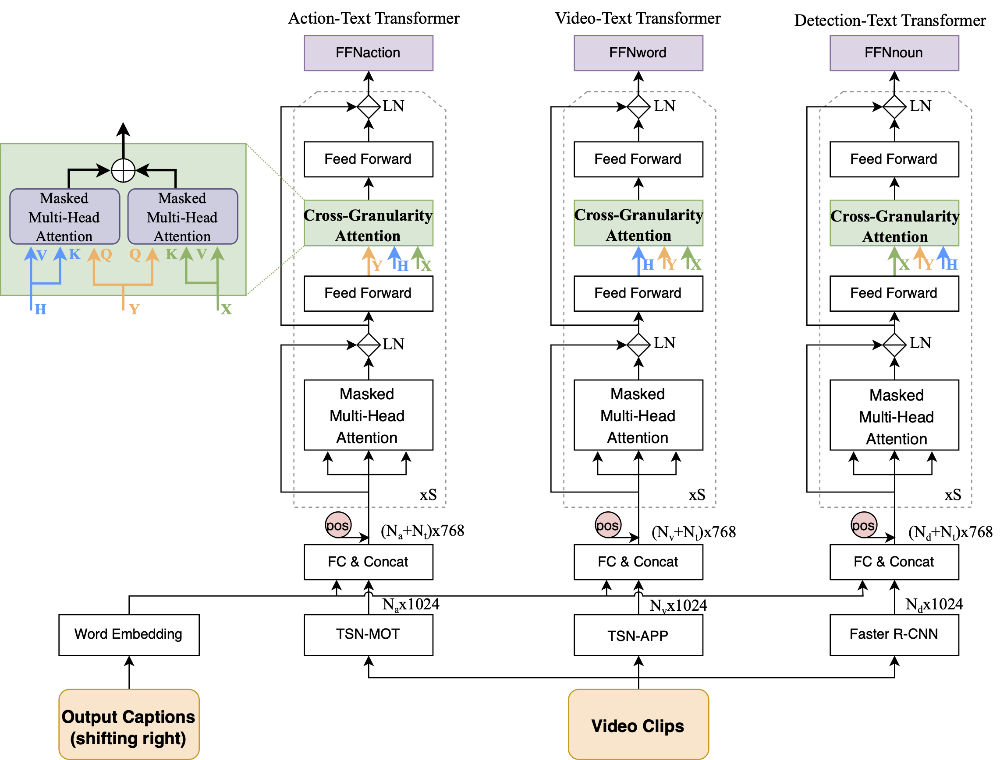
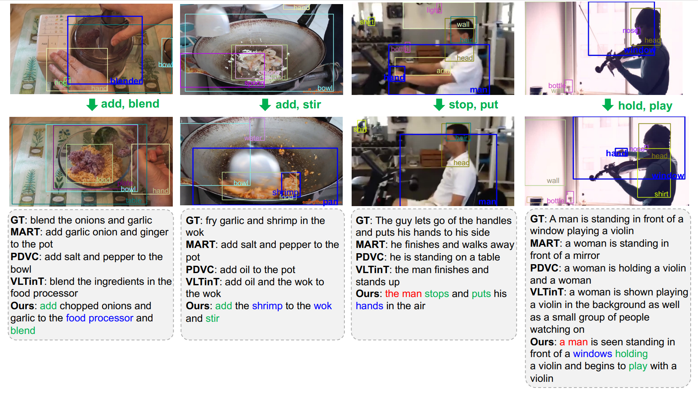

# COST - Collaborative Three-Stream Transformers for Video Captioning

**2023-08-04** (v0.1) This repository is the official implementation of COST (Collaborative Three-Stream Transformers for Video Captioning), which was recently accepted by **Computer Vision and Image Understanding**.

<div align="center">
    
</div>

## Get Started

### Requirements
Clone this repository and install dependencies. We haved tested our code on `python=3.8.5`, `torch=1.12.1` and `cuda=11.3.1`. A suitable conda environment named `cost` could be created and activated by following commands.
```
git clone https://github.com/wanghao14/COST.git
cd COST
conda create -n cost python=3.8.5
conda activate cost
pip install -r requirements.txt
```
**Note:** The METEOR metric requires `java`. You can install it with conda by `conda install openjdk`. Make sure your locale is set correct i.e. `echo $LANG` outputs `en_US.UTF-8`

### Prepare video features
Download the appearance and motion features of YouCookII from Google Drive: [rt_yc2_feat.tar.gz (12GB)](https://drive.google.com/file/d/1mj76DwNexFCYovUt8BREeHccQn_z_By9/view?usp=sharing), which are repacked from features provided by [densecap](https://github.com/salesforce/densecap#annotation-and-feature), and the extracted detection features provided by us: [yc2_detect_feat.tar.gz (34.7GB)](https://drive.google.com/drive/folders/1_OTzjTaflMrrodq7-mgnBYuYAXsIeYQu?usp=sharing). Extract the former one such that they can be found in `data/mart_video_feature/youcook2/*.npy` under this repository, and the latter one to `data/yc2_detect_feature/training_aggre/*.npz` and `data/yc2_detect_feature/training_aggre/*.npz` respectively. Otherwise you can specify the path for reading video features in **dataset.py**. 

### Train and validate
All hyper-parameters for our experiments could be modified in the used config file, and `configs/yc2_non_recurrent.yaml` is used in default in current version.
```
# Train COST on YouCookII 
CUDA_VISIBLE_DEVICES=0, 1 torchrun --standalone --nnodes=1 --nproc_per_node=2 train.py
```
When you validate the provided checkpoints, just modify two values in `configs/yc2_non_recurrent.yaml`:
```
validate: true
exp:
  load_model: "${PATH_TO_CHECKPOINT}"
```
and run the same command as starting training. You can download our pretrained model from [Google Drive](https://drive.google.com/drive/folders/1_OTzjTaflMrrodq7-mgnBYuYAXsIeYQu?usp=sharing).

### Model performance
- Quantitative results:
~~~bash
# Output:
# B@4, M, C and R@4 indicate BLEU@4, METEOR, CIDEr-D and Repetition@4, repectivaly. And the results in the first five rows are evaluated in the paragraph-level mode while the last one are in the micro-level mode.
# experiment       |          B@4|            M|            C|          R@4|  
# -----------------|-------------|-------------|-------------|-------------|
# yc2(val)_TSN     |         9.47|        17.67|        45.54|         4.04|
# yc2(val)_COOT    |        11.56|        19.67|        60.78|         6.63|
# anet(val)_TSN    |        11.22|        16.58|        25.70|         7.09|
# anet(test)_TSN   |        11.14|        15.91|        24.77|         5.86|
# anet(test)_COOT  |        11.88|        15.70|        29.64|         6.11|
# msvd(test)       |         56.8|         37.2|         99.2|         74.3|
~~~

- Qualitative results:
<div align="center">
    
</div>

## TODO
I have been a little busy recently, and the following works will be pushed forward in my free time.
- [x] Release initial version which supports multi-gpu training and inference on YouCookII
- [ ] Release pre-trained models and support training with COOT features as input
- [ ] Release detection features and pre-trained models, and support training for ActivityNet-Captions

I graduated this summer, and the data on the laboratory machine has been cleared. If you need it, please feel free to ask, and I will do my best to provide details for reproduction.

## Acknowledgment
We would like to thank the authors of [MART](https://github.com/jayleicn/recurrent-transformer) and [COOT](https://github.com/gingsi/coot-videotext) for sharing their codes.

## Citation
If you find this project is useful for your research, please cite our work.
```text
@article{wang2023collaborative,
  title={Collaborative three-stream transformers for video captioning},
  author={Wang, Hao and Zhang, Libo and Fan, Heng and Luo, Tiejian},
  journal={Computer Vision and Image Understanding},
  volume={235},
  pages={103799},
  year={2023},
  publisher={Elsevier}
}
```